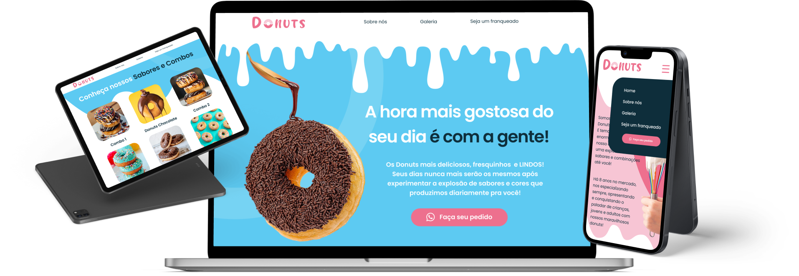

  
  
  
  
  

<h1 align="center">Desafio Chefão</h1>

A Gama Academy nos desafiou a criar todo um produto da etapa 0, em um grupo composto por desenvolvedores e designers. 

---

# :computer: Projeto

 O projeto foi criado pensando em fugir de ideias convencionais e partir para uma área diferente. Visto que a páscoa estava próxima, uma das nossas primeiras ideias foi uma loja envolvendo algum tipo de chocolate. 

---

## :rocket: Tecnologias
- React.js
- Node.js
- Express
- MySQL

## :rocket: Funcionalidades
- O site contém 4 páginas
- Responsivo para todos os dispositivos
- Utilização de bibliotecas
- Cadastro salvo no banco de dados
- Consumo de APIs

## :eyes: Demonstração
- No link abaixo você pode conferir o site
- https://loja-donuts.vercel.app/

## Desenvolvedores
  <table>
    <tr>
        <td align="center">
            <a href="https://www.linkedin.com/in/henrique-lauar-64a308217/">
                 
                
                    <b>Henrique Lauar</b>
                
            </a>
        </td>
        <td align="center">
            <a href="https://github.com/rapharodrigues04">
                 
                
                  <b>Rapha Rodrigues</b>
                
            </a>
        </td>
        <td align="center">
            <a href="https://github.com/GiseleCorreia">
                 
                
                    <b>Gisele Correia</b>
                
            </a> 
        </td>
    </tr>
          <td align="center">
            <a href="https://github.com/queleandrade">
                 
                
                    <b>QueleAndrade</b>
                
            </a> 
        </td>
    </tr>
</table>
